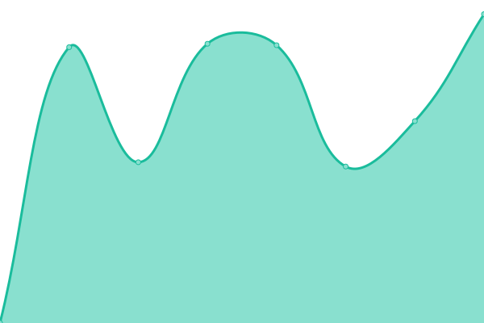
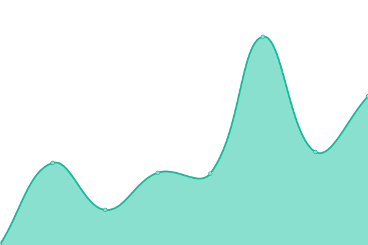
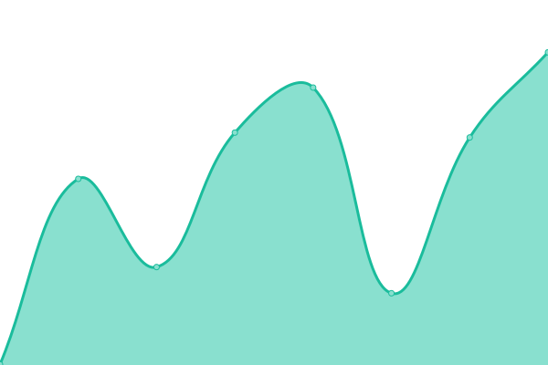
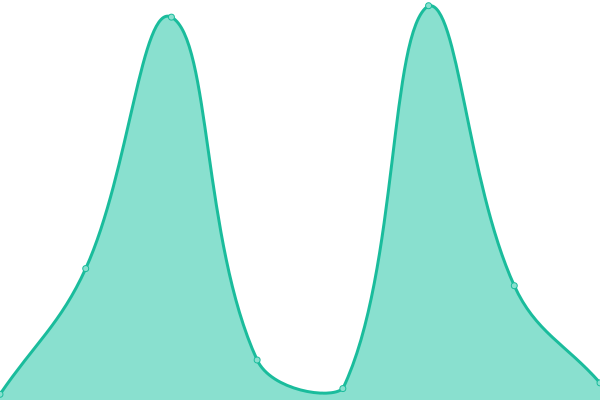
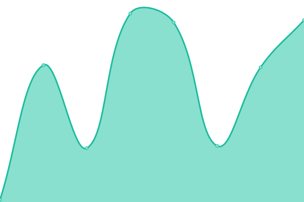

# [📈 Live Status](https://demo.upptime.js.org): <!--live status--> **🟩 All systems operational**

This repository contains the open-source uptime monitor and status page for [kiyomolee](https://demo.upptime.js.org), powered by [Upptime](https://github.com/upptime/upptime).

With [Upptime](https://upptime.js.org), you can get your own unlimited and free uptime monitor and status page, powered entirely by a GitHub repository. We use [Issues](https://github.com/kiyolee0425/upptime/issues) as incident reports, [Actions](https://github.com/kiyolee0425/upptime/actions) as uptime monitors, and [Pages](https://demo.upptime.js.org) for the status page.

<!--start: status pages-->
<!-- This summary is generated by Upptime (https://github.com/upptime/upptime) -->
<!-- Do not edit this manually, your changes will be overwritten -->
<!-- prettier-ignore -->
| URL | Status | History | Response Time | Uptime |
| --- | ------ | ------- | ------------- | ------ |
|  [SeaVantage Marine Platform](https://svmp.seavantage.com) | 🟩 Up | [sea-vantage-marine-platform.yml](https://github.com/kiyolee0425/upptime/commits/HEAD/history/sea-vantage-marine-platform.yml) | 

 1887ms
     
 | 

<a href="https://kiyolee0425.github.io/upptime/history/sea-vantage-marine-platform">100.00%</a>
    

|  [Wikipedia](https://en.wikipedia.org) | 🟩 Up | [wikipedia.yml](https://github.com/kiyolee0425/upptime/commits/HEAD/history/wikipedia.yml) | 

 346ms
     
 | 

<a href="https://kiyolee0425.github.io/upptime/history/wikipedia">100.00%</a>
    

|  [Hacker News](https://news.ycombinator.com) | 🟩 Up | [hacker-news.yml](https://github.com/kiyolee0425/upptime/commits/HEAD/history/hacker-news.yml) | 

 329ms
     
 | 

<a href="https://kiyolee0425.github.io/upptime/history/hacker-news">100.00%</a>
    

|  [AIS Connection ORBCOMM](globalais2.orbcomm.net) | 🟩 Up | [ais-connection-orbcomm.yml](https://github.com/kiyolee0425/upptime/commits/HEAD/history/ais-connection-orbcomm.yml) | 

 7ms
     
 | 

<a href="https://kiyolee0425.github.io/upptime/history/ais-connection-orbcomm">8.81%</a>
    

|  [AIS Connection SPIRE](streamingv2.ais.spire.com) | 🟩 Up | [ais-connection-spire.yml](https://github.com/kiyolee0425/upptime/commits/HEAD/history/ais-connection-spire.yml) | 

 79ms
     
 | 

<a href="https://kiyolee0425.github.io/upptime/history/ais-connection-spire">8.09%</a>
    

<!--end: status pages-->

[**Visit our status website →**](https://demo.upptime.js.org)

## 📄 License

- Powered by: [Upptime](https://github.com/upptime/upptime)
- Code: [MIT](./LICENSE) © [Anand Chowdhary](https://anandchowdhary.com), supported by [Pabio](https://pabio.com)
- Data in the `./history` directory: [Open Database License](https://opendatacommons.org/licenses/odbl/1-0/)
